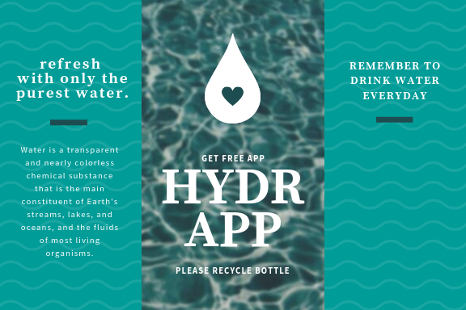

# hydrapp

## Zapraszam do pobrania mojej aplikacji, która przypomina o codziennym piciu wody:

`npm install -g gulp-cli`

`npm install`

`gulp`

To publish your page using github pages use `npm run deploy`
